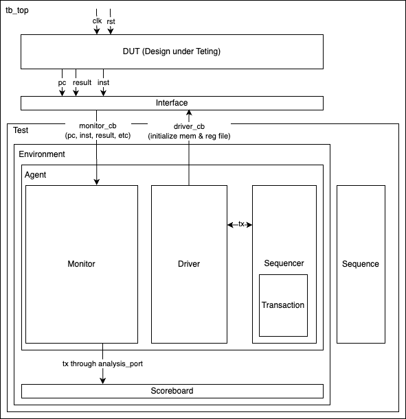

# RISC-V Processor Implementation and Verification

This documentations and all the codes are written by Yu-Hsuan (Yoshi) Chao. I started this side project since I realized that lots of the job for new grad asked for the verification skills, especially for UVM and SystemVerilog. First off, I tried Udemy course for SystemVerilog, UVM, and a follow-up project about UVM. The course gave me an initial glimpse about UVM and let me understand how powerful UVM is. However, the project is mostly about setting up easy UVM environment for some protocols (IC2, UART, SPI), and I feel like this isn't that interesting and I need more hands-on practice. So, I started to verifymy past project, which is a RISC-V 5 staged pipelined processor using UVM and document the learning path here as an open-source project.

## Processor Implementation

## Processor Verification (UVM)

### Overall UVM Structure



### File Structure
```
rtl_verification/
    |
    |--- env/
    |     |
    |     |--- agent/
    |     |     |
    |     |     |--- agent.sv
    |     |     |--- driver.sv
    |     |     |--- monitor.sv
    |     |     |--- sequence.sv
    |     |     |--- sequencer.sv
    |     |     |--- transaction.sv
    |     |
    |     |--- env.sv
    |     |--- scoreboard.sv
    |
    |--- tb/
    |     |--- interface.sv
    |
    |--- test/
    |     |--- test.sv
    |
    |--- tb_top.sv
```

### UVM Structure

#### Testbench Top
> file: `tb_top.sv`

`tb_top.sv` works as top level module to call both DUT (Design Under Testing) and our UVM test. ASssuming we are doing the RTL simluation, we need `top.sv`, which is our design, and the `testbench.sv`, which provides the testing signal. Same idea here but we use UVM test to replace the `testbench.sv` in RTL simulation.

`tb_top.sv` plays as the top module for our simulation, every module will be included in this root module, DUT and the interface for UVM testing will be connected, and the input siganl will be setup here (not necessary but for simplicity I am doing this in this project). For instance, we need to setup the `clk` and `rst` signal here since these are the input for our processor.  

In gerneral, most of the setups in `tb_top.sv` are very much alike with setup in RTL simulation testbench. Setting up the clk and rst signals, sending them into DUT and UVM environment, and dumping the waveform file. One thing noticeable is this section: 
```Verilog=
initial begin
    uvm_config_db#(virtual if)::set(null, "*", "vif", intf);
    run_test();
end
```
`uvm_config_db` is a built-in function for UVM which provides a global configurable database across all the verifcation components. The detailed explanation is as below: 
- `#(virtual if)` - storing a virtual interface into this global database
- `set(null, "*", "vif", intf);` - set the config for this component
    - `null` - means this component can be accessed by any component
    - `"*"` - means this config can be applied to all components in the hierachy
    - `"vif"` - represents the name (key) for this component
    - `intf` - represents the interface will be retrieved and used by other components

`run_test()` calls our the base_test for testing. To specify which test are we running, we can use `run_test(base_test)` to run the `base_test` class in `test.sv` file. The other option is to add `+UVM_TESTNAME=base_test` when running the simulation in command line.

#### Test
> file: `test/test.sv`


#### Transaction
> file: `env/agent/transaction.sv`

- **Purpose**: 
    
    The transaction class creates some standardized data structure that flows between verification components.

    In verification of our processor, our transaction represents a RISC-V instruction (RV32I ISA) along with its expected behavior (including memory addr/data, output reg/data).

- **Key Components**:
  
  - instruction
  - PC
  - expected results (both reg and data)
  - flags inside the processor (reg_write, mem_write, etc)
  - helper function

- **Implementation Details**:

    - `decode_instruction()` - breaks down 32-bit instruction
    - `convert2string()` - provides transaction information for debugging

#### Interface
> file: `tb/interface.sv`

- **Purpose**: 

    The interface acts as the bridge between the DUT and our verification env, allowing the testbench to reuse the interface for multiple testcases. The interface defines the contract between the hardware design and the software verification components. Thus, all signals used for our verification stages or passed into the DUT should be declared in this file. 
    
    The interface ensures proper synchronization through clocking blocks and provides separate access points for drivers and monitors. This maintains a clean verification environment.

- **Key Components**:
- **Implementation Details**:


